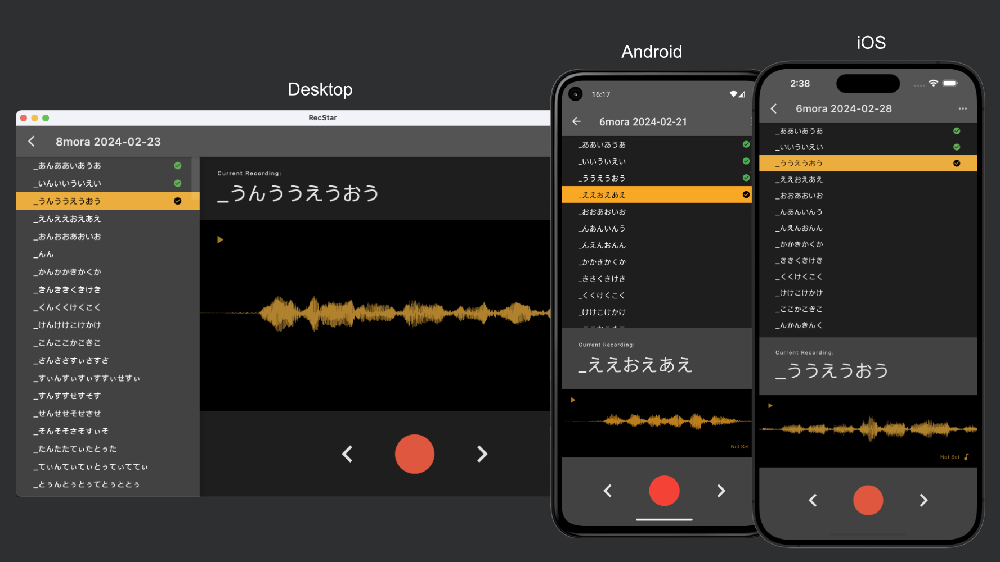
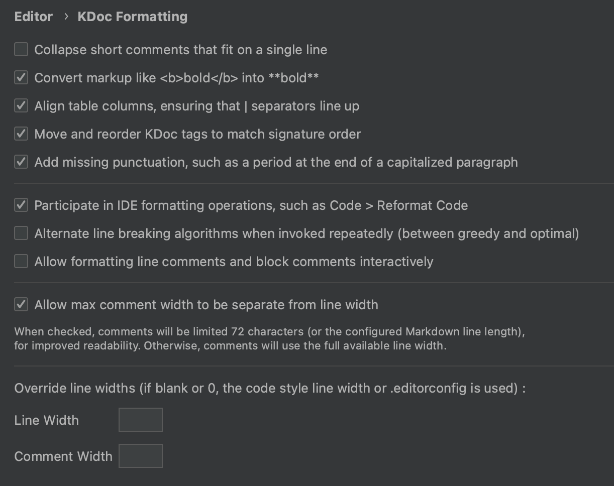

# RecStar

언어 선택: [English](README.md) | [简体中文](README-zhCN.md) | [日本語](README-ja.md) | [한국어](README-ko.md)

컴퓨터 / iOS / Android용 UTAU 형식 reclist (녹음 리스트) 녹음 프로그램

## 특징

- 개별 세션으로 녹음 관리 (녹음 리스트, 가이드 BGM 등)
- comment.txt 파일 지원
- 가이드 BGM으로 연속 녹음
- 녹음 후 행동 자동화 (녹음 후 자동으로 재생, 자동으로 넘어가기 등)
- bit depth, 샘플 레이트 변경 가능
- (컴퓨터 전용) 오디오 입력 기기 / 출력 기기 변경 가능
- 리스트를 불러올 때, 자동으로 인코딩 설정
- 다양한 크기를 위한 반응형 UI
- 다크 테마와 라이트 테마 지원
- 다양한 언어 지원 (영어, 일본어, 중국어, 한국어)

## 다운로드

[릴리즈 페이지](https://github.com/sdercolin/recstar/releases)에서 최신 버전을 확인 가능합니다.

### 컴퓨터

- Windows: `~win64.zip`
- macOS (Intel): `~mac-x64.dmg`
- macOS (Apple Silicon): `~mac-arm64.dmg`
- Ubuntu: `~amd64.deb`

이 외에 OS를 사용하고 있는 경우, 직접 빌드 해서 사용해 주세요.

### 안드로이드

#### APK

[릴리즈 페이지](https://github.com/sdercolin/recstar/releases)에서 최신 버전을 확인 가능합니다.

#### 플레이 스토어 (Play Store)

플레이 스토어에서 `RecStar`를 검색하시거나, 아래 링크를 클릭해주세요.
https://play.google.com/store/apps/details?id=com.sdercolin.recstar

### iOS

앱 스토어에서 `RecStar`를 검색해주세요.

## 시작하기

1. 사용하실 UTAU 녹음 리스트를 준비해주세요. 이미지에 사용된 리스트는 다음과 같습니다: [巽式連続音録音リスト](https://tatsu3.hateblo.jp/entry/ar426004)
2. "+" 버튼을 눌러 새로운 세션을 생성해주세요.
3. "..." 버튼을 눌러 녹음 리스트를 불러와 주세요. 만약 코멘트 파일이 필요하다면, 녹음 리스트와 함께 불러와 주세요. (녹음 리스트를 불러올 때, 코멘트 파일도 불러올 것이냐는 팝업이 뜹니다.)
4. 불러온 리스트를 선택하면, 세션이 만들어집니다.
5. (선택 사항) 만약 가이드 BGM을 사용하고 싶다면, 음표 버튼을 눌러 BGM을 불러와 주세요.
   만약 BGM 파일과 같은 이름의 BGM 설정파일(.txt)가 있다면, 자동으로 같이 불러와 집니다.
6. 녹음 버튼을 눌러 녹음을 시작해 주세요.
7. 오디오 파형을 누르면 녹음한 내용을 들을 수 있습니다.
8. 녹음이 다 끝난 후, "..."버튼을 눌러 "내보내기"나 "폴더 열기"를 선택하여 녹음을 다운로드 할 수 있습니다.

## 의견 혹은 오류 제공

만약 오류나, 더 좋은 아이디어가 있다면, [디스코드 서버](https://discord.gg/TyEcQ6P73y)에 #recstar 채널에 들어오거나, 리포지토리의 이슈 탭에서 알려주세요.

문제가 발생한 경우, "설정" -> "정보" -> "기기 정보 복사"를 눌러 기기의 정보도 같이 알려주시면 감사하겠습니다.

If you are using the desktop version, please also provide the log files located in the `logs` directory under the app
directory (you can open it with window menu "Help" -> "Open App Directory" in the app).

만약, 컴퓨터 버전을 사용 중인 경우, "도움말" -> "앱 폴더 열기" 를 누르면 있는 `logs` 폴더에 있는 로그 파일도 보내주시면 더욱 도움이 됩니다.

## 개발 시작하기

RecStar는 [Compose Multiplatform](https://github.com/JetBrains/compose-jb)으로 제작 되었습니다.

[README of the project template](README-compose.md)를 참고해 시작해주세요.

Other recommended settings

1. Install the `Kotlin KDoc Formatter` plugin, and use the following settings:
   
2. Run `./gradlew addKtlintFormatGitPreCommitHook` once to add a pre-commit hook that will automatically format your
   code before committing.
3. If in string definition files (e.g. [StringsEnglish.kt](shared/src/commonMain/kotlin/ui/string/StringEnglish.kt)), if
   the formatter of your Android Studio is always turning the wildcard imports into single imports, adjust the settings
   to allow wildcard imports on package `ui.string`.

## 크레딧

로고 디자인은 InochiPM님이 만들어주셨습니다.
